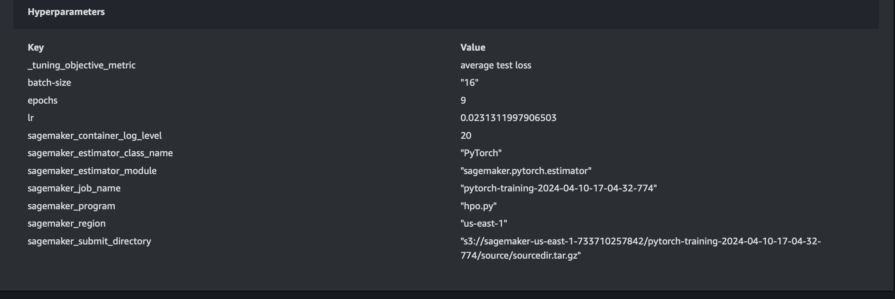
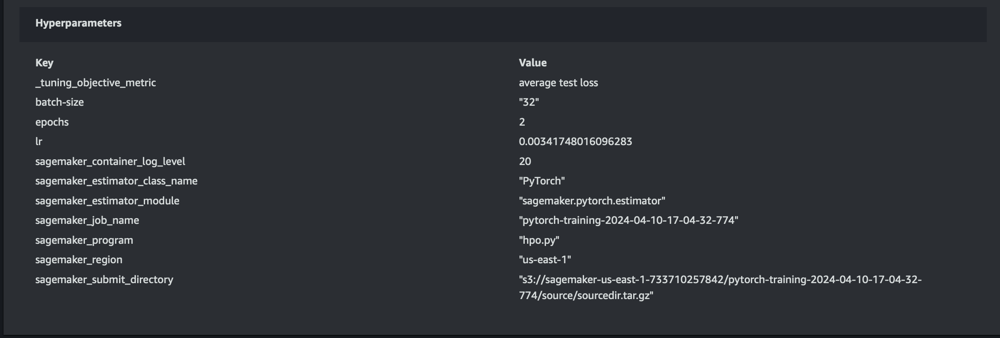
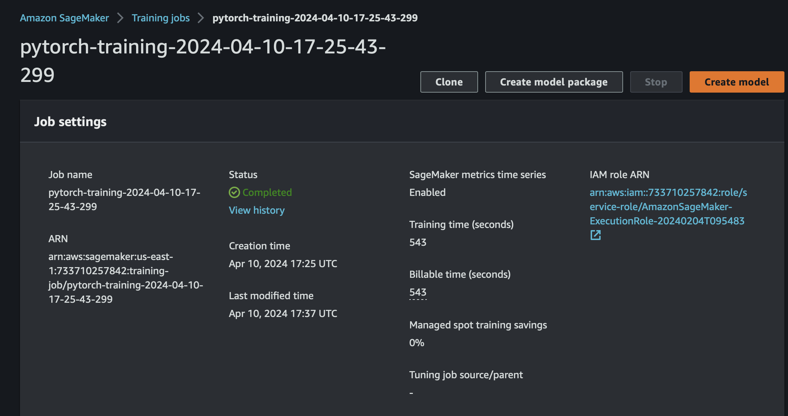
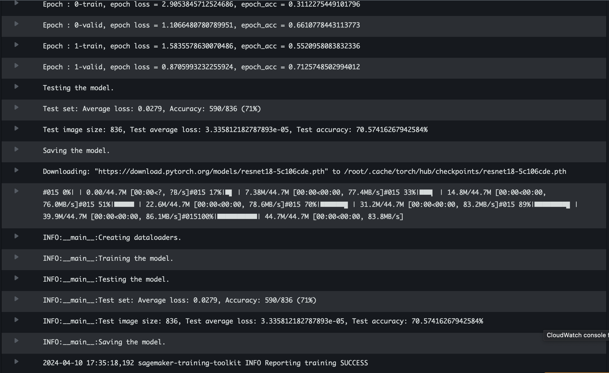
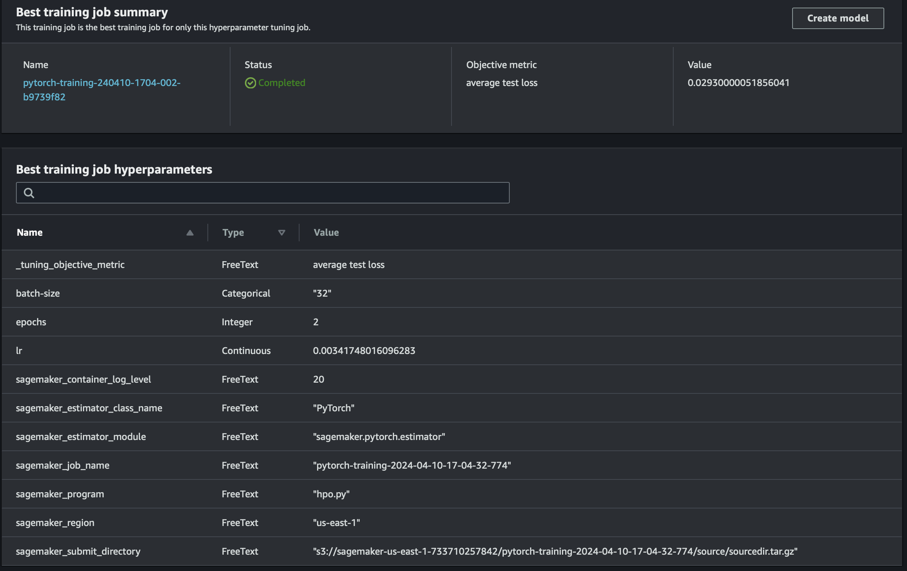
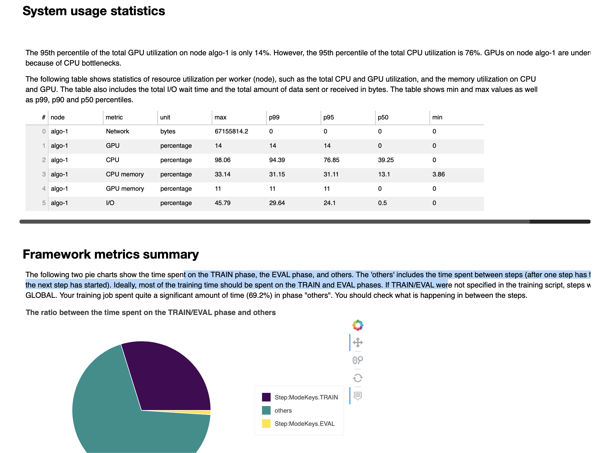
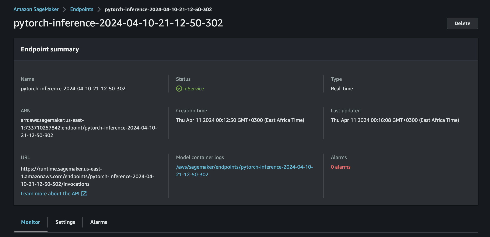

# Image Classification using AWS SageMaker

The project files contain a proposed machine learning workflow for a deep Convolutional Neural Network based on the pretrained ResNet-18 model and Transfer Learning algorithms. The neueral network will be trainined against a ready dataset of labeled images of dogs falling under 133 categories, evaluated and finally deployed. Sagemaker profiling hooks are added to analyse both system resource utilisation and model performance. 


## Project Set Up and Installation
The project files are run under SageMaker Studio with pytorch and python3 dependenices. 

`scripts/hpo.py` - Hyperparameter Tuning

`srcipts/train_model.py` - Model training logic

`scripts/inference.py` - Data pre-processor for ru
nning realtime inferences

`requirements.txt` - All dependencies required to run the source code

## Dataset
The provided image [dataset](https://s3-us-west-1.amazonaws.com/udacity-aind/dog-project/dogImages.zip) containing 6680 training images was used. 

### Access
In order to run multiple training jobs while maintaining access to the image dataset, the files were uploaded to S3 bucket `s3://sagemaker-us-east-1-733710257842/cd0387-dog-breed` 

## Hyperparameter Tuning
This project used the ResNet-18 model for solving the image classification task. ResNet-18 runs efficiently under limited computing resources, while being able to classify rich features representations from a big image data sets. 

The following hyperparameter ranges were applied;
| HPO        | Value Range                                |   |   |   |
|------------|--------------------------------------------|---|---|---|
| lr         | ContinuousParameter(0.001, 0.1)            |   |   |   |
| batch-size | CategoricalParameter([8, 16, 32, 64, 128]) |   |   |   |
| epochs     | IntegerParameter(2, 10)                    |   |   |   |


#### Results from HPO Job #1


#### Results from HPO Job #2 (Best)


#### Training Jobs

Training Job


Log Metrics during training


#### Tuning Phase 

Hyperparameters 



Best Hyper Parameters from all your training jobs

## Debugging and Profiling
Sagemaker debugger scripts are configured at the start of the training jobs to inspect the overall performance of the training phase. For this exercise the following rules were added; 

```python
# Defines what anomalises to detect
rules = [
    Rule.sagemaker(rule_configs.loss_not_decreasing()),
    ProfilerRule.sagemaker(rule_configs.LowGPUUtilization()),
    ProfilerRule.sagemaker(rule_configs.ProfilerReport()),
    Rule.sagemaker(rule_configs.vanishing_gradient()),
    Rule.sagemaker(rule_configs.overfit()),
    Rule.sagemaker(rule_configs.overtraining()),
    Rule.sagemaker(rule_configs.poor_weight_initialization()),
]
# Collects system resource utilisation data every 500ms to track any bottleneck problems
profiler_config = ProfilerConfig(
    system_monitor_interval_millis=500, framework_profile_params=FrameworkProfile(num_steps=5)
)

```

### Results


Summary Highlights from the profiling report;
1. GPU is underutilised at only 14%. (Might require switching to smaller instance)
2. Batchsize was tool small to utilize available GPU. 
3. The most expensive operator on the CPUs was "aten::conv2d".
4. Dataloaders only ran 1 worker in parallel, yet the CPU had 4 cores available.

## Model Deployment

The saved model data from the previous training job is used to create a PyTorchModel, along with the `entry_point` scripts to pre-process the image data during inference. Next, an instance is configured to run the PyTorchModel and consequently serve up an endpoint.

```python
pytorch_model = PyTorchModel(
    model_data=estimator.model_data,
    role=role,
    source_dir="scripts",
    entry_point='inference.py', #Required for model preprocessing
    framework_version='1.8.0',
    py_version='py36',
)

```

To make a prediction, the image file is parsed as bytes, along with a strict "ContentType" to ensure the right file format is processed. In response, the endpoint will return an array list of 133 predictions. 

```python
response = runtime.invoke_endpoint(
    EndpointName=latest_endpoint_name,
    ContentType='image/jpeg',
    Body=byte_array_of_image  
)

```

Deployed Realtime Endpoint



## Suggested Improvements (Unimplemented)

1. Stop training early when performance on validation dataset worsens. 
2. Implement ResNet-50 CNN to take advantage of higher capacity to learn intricate parterns and yeild a higher accuracy. However this model would require more computation resources. 
3. Perform manual data cleaning of the images to ensure the dog face is always centred. Images with artificial artifacts like timestamps should be cropped accordingly.

